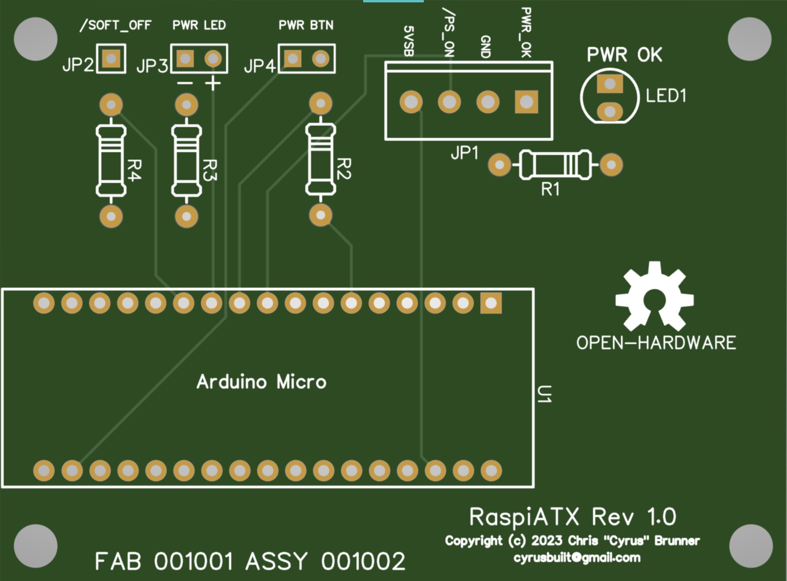

# RaspiATX
[](https://github.com/cyrusbuilt/RaspiATX/actions?query=workflows%3APlatformIO)

An ATX-style power management controller for Raspberry Pi.



## Synopsis

Many years ago, when the [Raspberry Pi](https://www.raspberrypi.com/) first came out, I came up with the idea (as did many others) to use one as a Home Theater PC (HTPC), so I came up with [this project](https://github.com/cyrusbuilt/CyrusBuiltHTPC). This was a crude but effective attempt at an Arduino-based ATX power management system to be used with the Raspiberry Pi along with a bunch of shell scripts to turn a normal Raspberry Pi Linux OS (Debian Jessie-based back then I believe) into a HTPC OS that booted straight into XMBC (which later became [Kodi](https://kodi.tv/)). The hardware was all packed in a Mini-ITX chassis which had it's own ATX power supply (DC-to-DC converter), but given the design of the Raspberry Pi, it's not exactly ATX-compliant. Hence the need for a power-management system if I wanted it to behave like a normal PC in that sense. But nowadays, there are custom Linux distributions like [LibreELEC](https://libreelec.tv/) that make my previous efforts obsolete. You can even get special carrier boards for Raspberry Pi and CM4 modules that do the ATX stuff (and more!).

However, for my purposes, I really need *JUST* the ATX power-management and since a recent incident involving my youngest daughter and some apple juice, my HTPC was damaged. So I decided to gut the whole thing and re-evaluate the design. I salvaged my Raspberry Pi (I had already upgraded twice since the initial build from the original Raspiberry Pi Model B to a Raspberry Pi 2, and then a Raspberry Pi 3 which is still in use since it does its job just fine) and had already upgraded to a larger SD card and I've been running LiberELEC since v8.0 or 9.0. My hacky (and improperly done) ATX power management board I had cobbled together with relays and perf-board was now toast along with the PSU and the RTC. So I replaced the RTC with a new one from Adafruit and set out to design a new power management board (using the same Arduino).

I'm still using a USB-to-SATA adapter with a 250GB 2.5" HDD for supplemental internal storage, but I mostly just stream content from my server which is running [miniDLNA](https://sourceforge.net/projects/minidlna/). The chassis' HDD LED still connects to the SATA adapter, but the power button and LED connect to this new power management board and the reset button connects directly to the Raspberry Pi.

The power button turns on the power with a single button press (when the system is off) and then turns the system off when the power button is held for ~5 seconds (I know 10 seconds is proper for ATX compliance, but I wanted to be able to kill power shortly after boot before the filesystems are mounted in R/W mode if necessary and the system just boots too damn fast, so 10 seconds is too long). But also, with a minor tweak to LibreELEC, this board can also handle soft-off by watching for the signal from Raspberry Pi to indicate it has shutdown and then this board will remove power.

## Software Configuration

To enable soft-off detection (assuming you are using LibreELEC or some other Raspbian or Raspberry Pi OS-based linux distro), you need to add the following line to /boot/config.txt:

```
dtoverlay=gpio-poweroff,gpio_pin=4,active_low=1
```

What it does: This causes the OS to assert GPIO 4 HIGH at startup and then when the system shuts down (halt), it asserts that same pin LOW. You can use a different pin if you'd like.  If you happen to be using a hardware RTC like me, this can be enabled by adding the following line in here as well:

```
dtoverlay=i2c-rtc,ds1307
```

I'm using a DS1307-based RTC, but if you are using a different on such as a DS3231, you'll need to adjust accordingly. Full documentation for the Device Tree overlays can be found [here](https://github.com/raspberrypi/firmware/blob/master/boot/overlays/README).

## Wiring

You'll need to make 4 connections from the ATX power supply to RaspiATX using the screw terminal block JP1. The PWR_OK (gray), ground (black), /PS_ON (green), and +5VSB (purple) all connect to the terminal block. The chassis power button (female dupont connectors) plug into the 2-pin male header JP4, the chassis power LED (female dupont connectors) connect to the 2-pin male header JP3 and the /SOFT-OFF signal connects to the 1-pin male header JP2. I recommend using a single wire with female dupont connectors on both ends to jumper from GPIO 4 on the Raspberry pin to JP2 on RaspiATX.

## Theory of Operation

At the heart of RaspiATX is an [Arduino Micro](https://docs.arduino.cc/hardware/micro), which boots as soon as it gets power from the 5VSB line from the PSU. Once initialized, it monitors the button state. When pressed and released once (assuming the system is currently off), it will drive /PS_ON LOW causing the ATX power supply to turn ON allowing the rest of the system to boot (the Raspberry Pi uses the +5V line from the PSU and the HDD needs both the +5V and +12V lines and the RTC gets it's power from the Raspberry Pi). If the power button is pressed and held for ~5 seconds once booted, then /PS_ON will be driven HIGH causing the PSU to turn off, thus removing power to the rest of the system and the Arduino resets it's state. RaspiATX watches the PWR_OK signal from the PSU (which also drives the status LED) to know when then system has turned on. Once initialized, it waits for the /SOFT_OFF signal to go HIGH to know that the Raspberry Pi has turned on and then enables soft-off detection. With soft-off detection enabled, it will monitor that signal and wait for it to go LOW. When that happens, it drives /PS_ON line HIGH to remove power. This way, when you tell Kodi to shutdown, the whole machine will turn off when the shutdown sequence completes. Caveat: by default, the gpio-poweroff overlay allows for a 3 second delay from when shutdown completes to turn the power off. If power isn't removed in that 3 second window, a kernel panic will occur. For this reason, RaspiATX turns off the PSU in ~1.5 seconds from when it detects /SOFT_OFF went LOW. I could probably remove this delay altogether, but I wanted to allow a brief delay for any buffers to flush to disk for the SD card and/or HDD or maybe even any externally connected peripherals (which again, might not even be necessary, but I figured just to be safe).